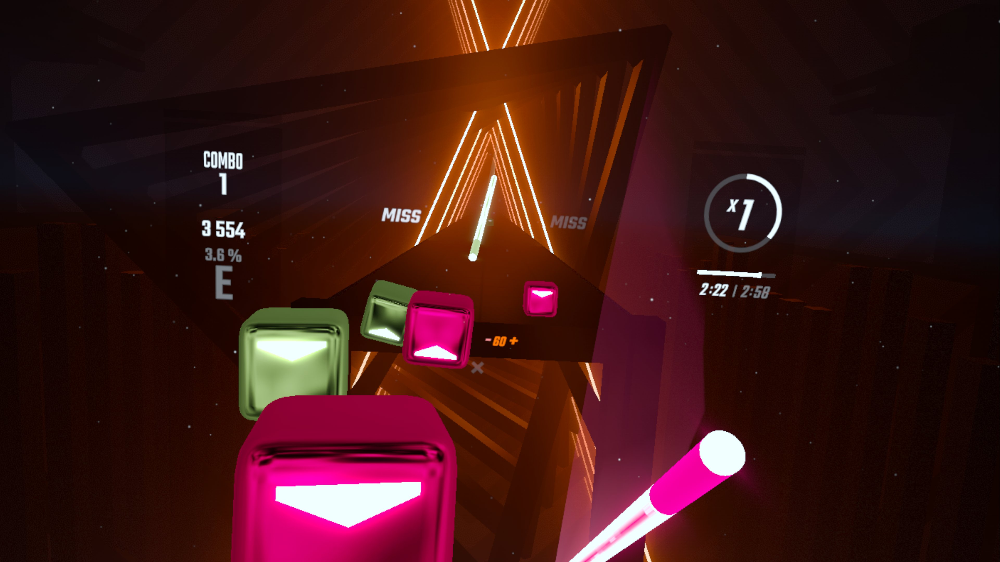

# TrickSaber for Beat Saber (Meta Quest)

Unleash your inner Jedi (or Sith!) with TriickSaber for the Meta Quest version of Beat Saber! This mod allows you to perform stylish spins and throws with your sabers, adding a new layer of flair and skill to your gameplay.

- **Current Version:** [0.0.1]
- **Compatible Beat Saber Version:** [1.37]

## Quick Note

Hey everyone! This is my very first mod, and I'm thrilled to share it with you. It was a fun, fast-paced project (all done in a day!), so if you spot any areas where I might have missed some established conventions, feel free to point 'em out.

I'd love to keep improving TrickSaber when time allows. Contributions are welcome if you're inspired to help refine it further! Your ideas and help would be fantastic.

Also, special credit to the creators and maintainers of core libraries such as `beatsaber-hook`, `bs-cordl`, and `BSML`, etc. which streamlined the development process significantly.

## Features

*   **Saber Spins:**
    *   Activate saber spins using configurable controller buttons.
    *   Customize spin direction for each saber.
    *   Adjust spin speed to your preference.
    *   Fine-tune the spin anchor point with a Z-axis offset from the handle.
*   **Saber Throws (Experimental/Work-in-Progress):**
    *   Throw your sabers using configurable controller buttons.
    *   Sabers fly in a straight line based on your hand's velocity at the moment of release.
    *   Imparts angular momentum based on active spin or a default roll.
    *   Configurable throw velocity multiplier.
    *   Sabers return to your hand upon button release.
    *   Adjustable saber return duration.
*   **In-Mod Settings Menu:**
    *   Globally enable or disable the mod.
    *   Easily configure all button bindings, spin parameters, and throw settings via BSML menu.
    

## Installation

1.  Download the latest `TriickSaber.qmod` file from the [releases page](https://github.com/BinitDOX/TriickSaber/releases).
2.  Open [MBF](https://mbf.bsquest.xyz/) and pair your quest with a USB.
3.  Select `Upload File` and choose the downloaded `TriickSaber.qmod` file.
4.  After a successful install via MBF, launch Beat Saber!

## How to Use

1.  Once in Beat Saber, go to `Settings -> Mod Settings`.
2.  Find `TrickSaber Settings`.
3.  Configure your desired buttons for:
    *   Left Saber Spin
    *   Left Saber Throw
    *   Right Saber Spin
    *   Right Saber Throw
4.  Adjust spin parameters (direction, speed, anchor offset) and throw velocity multiplier to your liking.
5.  Enable the mod if it's not already.
6.  Hop into a song and try out your new moves!
7.  Press and hold the configured buttons to activate spins or throws. Release the throw button to recall your saber.

## Configuration Options

*   **Global:**
    *   **Enable TrickSaber:** Master on/off switch for the mod.
*   **Per Saber (Left/Right):**
    *   **Spin Button:** Controller button to activate spin.
    *   **Spin Clockwise:** Toggles spin direction.
    *   **Spin Speed:** Rotation speed in degrees per second.
    *   **Spin Anchor Z-Offset:** Adjusts the pivot point along the saber's length.
    *   **Throw Button:** Controller button to initiate a throw.
    *   **Throw Velocity Multiplier:** Adjusts the speed of the thrown saber.
    *   **Saber Return Duration:** How quickly thrown sabers return (seconds).

## Future Plans

*   **Enhanced Throw Dynamics:** Improving the feel and physics of saber throws.
*   **Visual-Only Spin/Throw:** Refining spins and throws to affect only the saber's visual model, leaving colliders unaffected for fair gameplay.
*   **Score Safety:** Measures to disable score submission if trick actions affect saber physical colliders.

## Building from Source (For Developers)

This mod is built using C++ for the Quest version of Beat Saber (il2cpp).

**Prerequisites:**
*   Android NDK
*   Quest Package Manager (QPM)
*   PowerShell (pwsh) for build scripts
*   CMake & Ninja

**Build Steps:**
1.  Clone the repository: `git clone https://github.com/BinitDOX/TriickSaber.git`
2.  Navigate to the project directory: `cd TriickSaber`
3.  Restore QPM dependencies: `qpm restore`
4.  Run the build script:
    *   To build the `.so` library: `pwsh ./scripts/build.ps1`
    *   To build the `.qmod` package: `pwsh ./scripts/buildQMOD.ps1 TriickSaber`

The resulting `.qmod` will be in the project's root directory.

## Credits
*   **Core Libraries:** Immense thanks to the developers of `beatsaber-hook`, `bs-cordl`, `BSML`, `config-utils`, `custom-types`, and other foundational libraries that power Quest modding.
*   **Initial Guide:** Followed from the [BS Modding Guide by danrouse](https://github.com/danrouse/beatsaber-quest-modding-guide).
*   **Project Template:** Adapted from Tatenshi's [RandomSongPicker](https://github.com/Tatenshi/RandomSongPicker).
*   **Concept Inspiration:** The idea for TrickSaber was inspired by existing PC/Quest TrickSaber mods (no code directly used or viewed).
*   **AI Assistant:** Gemini 2.5 Pro provided development and documentation assistance. ChatGPT for cover image.
